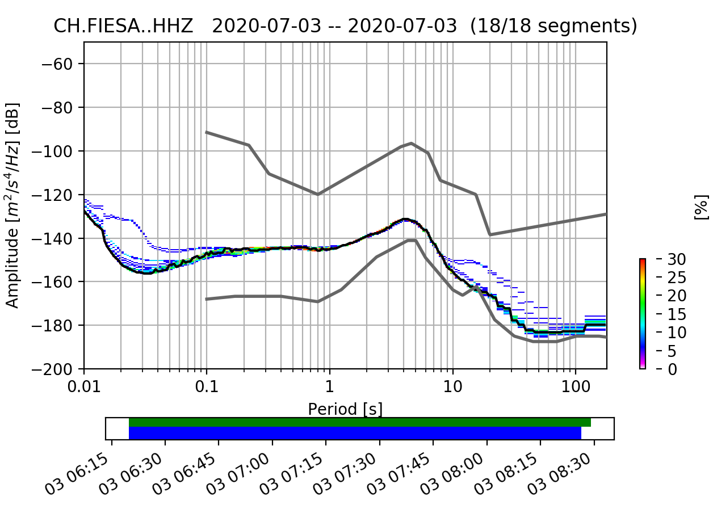

# fdsnws2ppsd

## What?
Make PPSD analysis directly from an FDSN web service. 
It uses data and metadata from the last 2 hours.
The code requires `Python3`, `Obspy` and `Matplolib`.

Here's a quick example, reproduces the header image:
```
/Users/me/anaconda3/bin/python3 ./fdsnws2ppsd.py "CH.FIESA..HHZ" -plot=ppsd ETH                                                               
```

## How?
Given channel seedid `NN.SSSS.LL.CCC`, and fdsnws running at `http:///localhost:8080/`, run as:
```
python3 ./fdsnws2ppsd.py "NN.SSSS.LL.CCC" [-plot=spec,temp,site,ppsd] [http://localhost:8080/]
```
Arguments:
- first argument is seedid, it is mandatory, Unix patterns might be used to get several id at a time.
- `The `-plot` option specifies plot types, it is optional, does all plots by default.
- Last argument is fdsnws url, it is optional and localhost by default.
> Note that an [`Obspy` shortcut](https://docs.obspy.org/packages/obspy.clients.fdsn.html#id1) could be used as fdsnws url. 

The last data and metadata are saved locally in the current directory.
The code can also use local files instead of fdsnws, run as:
```
python3 ./fdsnws2ppsd.py "NN.SSSS.LL.CCC" [-plot=spec,temp,site,ppsd] [data (e.g. mseed)] [metadata (e.g. fdsn.xml)]
```
In this case, data and metadata should be in Obspy compatible formats.

## Next?
1. Improve user interface.
1. Add control for time selection. 
